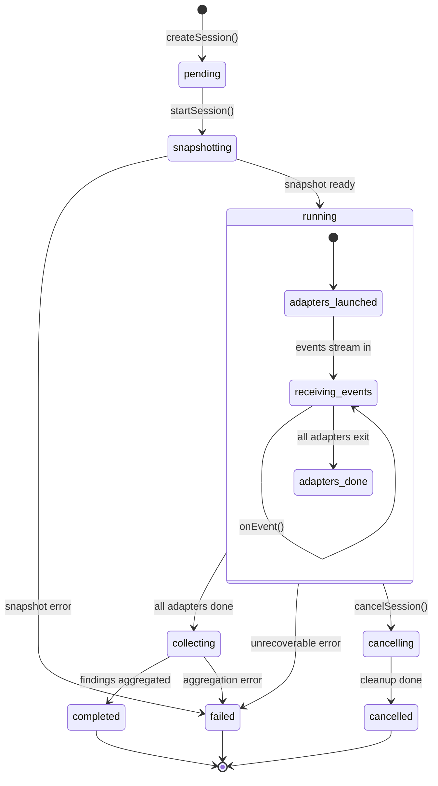
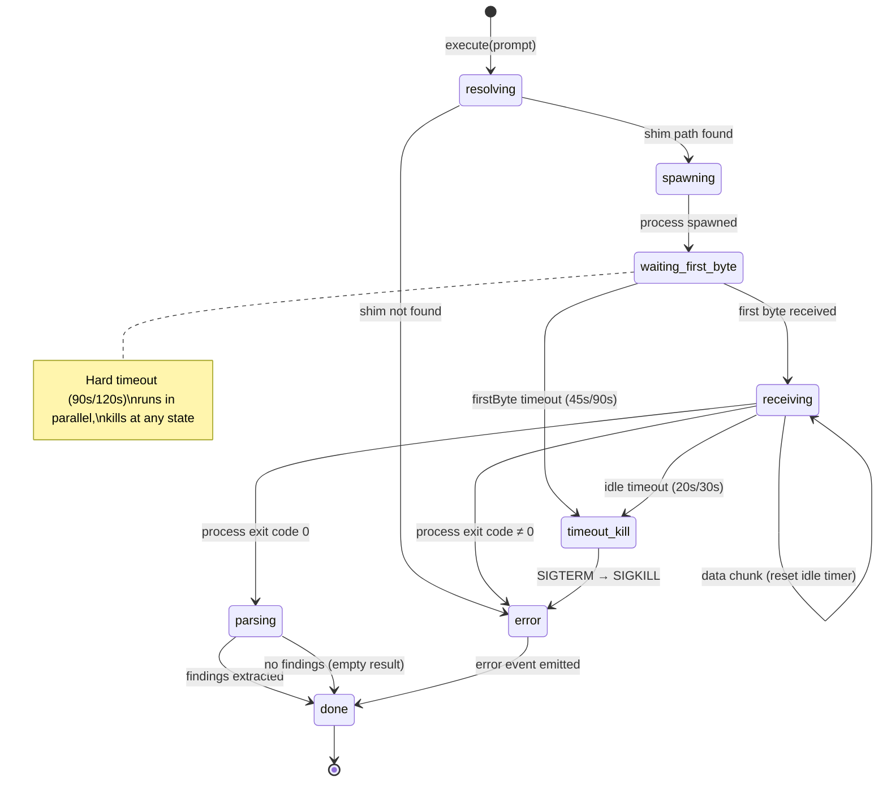
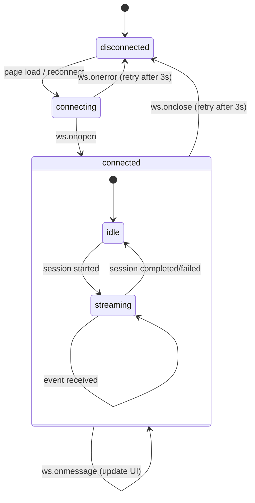
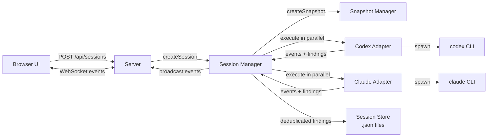

# Critique Request: Phase 1 Implementation Plan

You are a senior code reviewer and architect. Your job is to critique the implementation plan below. Be harsh, specific, and constructive. No fluff.

## Context

This is a multi-agent communication hub that enables AI agents (Antigravity, Codex CLI, Claude Code CLI) to collaborate on code review through an event-driven architecture. Phase 0 Spike is complete with all gate tests passed (evidence in `docs/spike-results-v3.json`).

The implementation plan below describes Phase 1: the core Event-Driven Hub build.

## Your Task

1. Read the implementation plan carefully
2. Find issues, gaps, risks, or mistakes
3. For each finding, provide:
   - **Category**: one of [architecture, testing, security, performance, correctness, missing, naming, windows-compat]
   - **Severity**: one of [critical, high, medium, low]
   - **Finding**: what's wrong
   - **Evidence**: why you think it's wrong (reference specific sections)
   - **Recommendation**: actionable fix

## Key things to check:
- Does the architecture match the state machines?
- Are the timeout values proven by spike evidence?
- Is the testing strategy complete (unit tests mock correctly, integration tests actually test)?
- Windows compatibility (this runs on Windows, PowerShell)
- Are there race conditions in parallel adapter execution?
- Is the finding dedup strategy correct? Could it miss findings or false-merge?
- Is the snapshot strategy (git worktree) safe on Windows?
- Is the WS server handling backpressure?
- File path handling (Windows backslashes vs POSIX)
- Error propagation from adapters → hub → server → client
- Is the REST API design RESTful and consistent?

## IMPORTANT RULES
- Do NOT suggest TypeScript migration — that's explicitly Phase 2
- Do NOT suggest adding a database — JSON files are the Phase 1 decision
- Do NOT suggest Express/Fastify — vanilla HTTP is intentional
- Focus on what's WRONG or MISSING, not what's right
- Maximum 10 findings, minimum 3
- Output as structured markdown with numbered findings

---

## Implementation Plan

# Phase 1: Event-Driven Hub — Implementation Plan

Phase 0 Spike is ✅ complete — all patterns proven (`spike-results-v3.json`). This plan covers the Phase 1 Core Hub build: Agent Adapters, Hub/Session Manager, Review Snapshot, Finding Schema, and a simple browser UI.

## User Review Required

> [!IMPORTANT]
> **JavaScript or TypeScript?** AGENTS.md says "JavaScript (migrating to TypeScript in Phase 1)". This plan uses **JavaScript with JSDoc types** for iteration speed. TypeScript migration can happen in Phase 2.

> [!IMPORTANT]
> **Framework choice**: This plan uses vanilla Node.js HTTP + `ws` WebSocket. No Express needed at this scale. Should this change?

> [!WARNING]
> **Codex and Claude CLI must be globally installed** on the machine for tests to pass. The plan assumes both are available via `where codex` / `where claude`.

---

## State Machines

### Session Lifecycle

The core state machine — every review session follows this flow:



**Guards & side-effects:**

| Transition | Guard | Side-effect |
|---|---|---|
| `pending → snapshotting` | session exists | `snapshotManager.create()` |
| `snapshotting → running` | snapshot path valid | launch Codex + Claude adapters in parallel |
| `running.onEvent()` | valid event envelope | deduplicate finding, broadcast via WS |
| `running → collecting` | both adapters exited | stop heartbeat timer |
| `collecting → completed` | — | persist session JSON, cleanup snapshot |
| `* → failed` | error caught | persist error, cleanup snapshot |
| `running → cancelling` | session is running | kill adapter processes (SIGTERM → SIGKILL) |

---

### Adapter Execution

Each agent adapter (Codex/Claude) follows this internal state machine with 3-tier timeout:



**Timeout tiers (from spike v3):**

| Tier | Codex | Claude | Purpose |
|---|---|---|---|
| `firstByte` | 45s | 90s | Detect CLI not responding at all |
| `idle` | 20s | 30s | Detect hung process mid-output |
| `hard` | 90s | 120s | Absolute max wall-clock time |

---

### WebSocket Client (Browser UI)



---

### Data Flow Overview



---

## Proposed Changes

### Pre-requisites: Package Setup

#### [MODIFY] [package.json](file:///d:/extension/package.json)

Add proper project metadata, scripts, and dependencies:

```json
{
  "name": "extension-hub",
  "version": "0.1.0",
  "type": "module",
  "scripts": {
    "start": "node src/server.js",
    "test": "node --test src/**/*.test.js",
    "test:unit": "node --test src/**/*.test.js",
    "spike": "node scripts/spike-test-v3.js"
  },
  "dependencies": {
    "cross-spawn": "^7.0.6",
    "ws": "^8.18.0",
    "uuid": "^9.0.0"
  },
  "devDependencies": {}
}
```

Uses Node.js 20 built-in test runner (`node --test`) — no Jest/Vitest dependency needed.

---

### Component 1: Agent Adapter Layer

Extracts the proven `runAgent()` pattern from `spike-test-v3.js` into a reusable adapter that emits structured events.

#### [NEW] [src/adapters/base-adapter.js](file:///d:/extension/src/adapters/base-adapter.js)

Base class for all agent adapters. Core responsibilities:
- Wraps `cross-spawn` with 3-tier timeout (from spike v3)
- Emits structured events: `status`, `finding`, `error`, `heartbeat`
- Captures stdout/stderr separately, decodes explicit UTF-8
- Detects garbled output (replacement chars `\ufffd`) — logs warning, skips relay
- Provides `combinedBytes` for pass/fail (not just stdoutBytes)

Key methods:
- `execute(prompt, opts)` → returns `{ events[], rawResult }`
- `parseOutput(rawResult)` → extract findings from raw text (override per agent)
- `#spawnWithTimeout(file, args, timeouts)` → private, reuses spike v3's `runAgent()`

#### [NEW] [src/adapters/codex-adapter.js](file:///d:/extension/src/adapters/codex-adapter.js)

Codex-specific adapter:
- Resolves `codex` shim path (reuses `resolveShim()` from spike v3)
- Command: `codex review "<prompt>"` 
- Timeout preset: `firstByte=45s, idle=20s, hard=90s`
- Output parsing: Codex outputs to **stderr** — parse combinedOutput
- Finding extraction: regex-based extraction of severity/file/line patterns

#### [NEW] [src/adapters/claude-adapter.js](file:///d:/extension/src/adapters/claude-adapter.js)

Claude Code CLI adapter:
- Resolves `claude` shim path
- Command: `claude -p --no-session-persistence "<prompt>"`
- Supports `--output-format json` for structured output
- Timeout preset: `firstByte=90s, idle=30s, hard=120s`
- Finding extraction: parse structured JSON output when available, fallback to text parsing

#### [NEW] [src/adapters/base-adapter.test.js](file:///d:/extension/src/adapters/base-adapter.test.js)

Unit tests (no CLI required — mock spawn):
- Event emission format validation
- 3-tier timeout behavior (firstByte, idle, hard)
- UTF-8 garble detection
- combinedBytes calculation
- Error handling (spawn failure, signal)

---

### Component 2: Event Schema & Finding Model

#### [NEW] [src/schema/events.js](file:///d:/extension/src/schema/events.js)

Event factory functions matching BRIEF.md schema:

```javascript
// Creates validated event envelope
function createEvent(sessionId, agentId, eventType, payload) { ... }

// Creates finding with auto-generated dedupe_key
function createFinding({ severity, summary, evidence, file, line, confidence }) { ... }

// Dedupe key: hash(severity + file + line + summary)
function computeDedupeKey(finding) { ... }
```

#### [NEW] [src/schema/events.test.js](file:///d:/extension/src/schema/events.test.js)

Tests:
- Event envelope has all required fields
- Finding schema validation (severity enum, confidence range)
- Dedupe key is deterministic (same input → same key)
- Dedupe key differs when fields change

---

### Component 3: Review Snapshot Manager

#### [NEW] [src/snapshot/snapshot-manager.js](file:///d:/extension/src/snapshot/snapshot-manager.js)

Creates immutable review snapshots:
- `createSnapshot(workspacePath)` → `{ snapshotId, commitHash, snapshotPath }`
- Uses `git worktree add --detach` for read-only review copy
- Fallback: if worktree fails, use `robocopy /MIR` to temp directory
- `cleanupSnapshot(snapshotId)` → removes worktree/temp copy
- All findings tagged with `commit_hash` + `snapshot_id`

#### [NEW] [src/snapshot/snapshot-manager.test.js](file:///d:/extension/src/snapshot/snapshot-manager.test.js)

Tests (uses temp git repos, no real workspace):
- Snapshot creates a directory with correct commit hash
- Snapshot is read-only (or at least separate from source)
- Cleanup removes the snapshot directory
- Commit hash matches current HEAD

---

### Component 4: Hub / Session Manager

The orchestration core. Manages review sessions from start to finish.

#### [NEW] [src/hub/session.js](file:///d:/extension/src/hub/session.js)

Session lifecycle:
- `createSession(opts)` → `{ sessionId, status: 'pending' }`
- `startSession(sessionId)` → creates snapshot, launches adapters in parallel
- `onEvent(sessionId, event)` → routes events, deduplicates findings
- `endSession(sessionId)` → collects all findings, cleanup snapshot
- Status transitions: `pending → running → completed | failed | cancelled`

Finding aggregation:
- Collects findings from both agents
- Deduplicates by `dedupe_key`
- Merges when both agents flag same file/line (takes higher severity)

#### [NEW] [src/hub/session-store.js](file:///d:/extension/src/hub/session-store.js)

Simple file-based persistence:
- `save(session)` → writes JSON to `.extension/sessions/<id>.json`
- `load(sessionId)` → reads session from disk
- `list()` → returns all session summaries
- No database — JSON files are sufficient for Phase 1

#### [NEW] [src/hub/session.test.js](file:///d:/extension/src/hub/session.test.js)

Tests (mock adapters):
- Session lifecycle transitions
- Finding dedup (same dedupe_key → one finding)
- Finding merge (same file/line, different severity → higher wins)
- Session persistence (save + load roundtrip)
- Cancel mid-session cleans up snapshot

---

### Component 5: HTTP + WebSocket Server

#### [NEW] [src/server.js](file:///d:/extension/src/server.js)

Vanilla Node.js HTTP server + `ws` WebSocket:

**REST endpoints:**
- `POST /api/sessions` → create + start a review session
- `GET /api/sessions` → list all sessions
- `GET /api/sessions/:id` → get session details + findings
- `POST /api/sessions/:id/cancel` → cancel running session
- `GET /` → serve static UI

**WebSocket:**
- `ws://localhost:3456/ws` → real-time event stream
- Client subscribes to session events
- Server broadcasts: `status`, `finding`, `heartbeat`, `error`

#### [NEW] [src/server.test.js](file:///d:/extension/src/server.test.js)

Tests (mock hub):
- REST endpoint response shapes
- WebSocket connection + event broadcast
- Session creation via API
- Error handling (invalid session ID, etc.)

---

### Component 6: Browser UI

Simple single-page app served statically. No build step.

#### [NEW] [src/ui/index.html](file:///d:/extension/src/ui/index.html)

Dark-themed, modern UI with:
- **Header:** Project name, connection status indicator
- **Session panel:** Start new review, session list
- **Timeline:** Real-time event feed (status changes, findings arriving)
- **Findings table:** Sortable by severity, file, agent — with dedupe indicators
- WebSocket connection for live updates
- Responsive layout

#### [NEW] [src/ui/styles.css](file:///d:/extension/src/ui/styles.css)

Dark theme, modern aesthetics:
- CSS custom properties for theming
- Glassmorphism cards
- Color-coded severity badges (🔴 critical, 🟠 high, 🟡 medium, 🟢 low)
- Smooth transitions for event timeline

#### [NEW] [src/ui/app.js](file:///d:/extension/src/ui/app.js)

Client-side JavaScript:
- WebSocket connection with auto-reconnect
- Fetch API for REST calls
- DOM manipulation for event timeline + findings table
- Session management UI

---

## File Structure Summary

```
d:\extension\
├── src/
│   ├── adapters/
│   │   ├── base-adapter.js          # Core spawn + timeout + event emission
│   │   ├── base-adapter.test.js     # Unit tests (mock spawn)
│   │   ├── codex-adapter.js         # Codex CLI adapter
│   │   └── claude-adapter.js        # Claude Code CLI adapter
│   ├── schema/
│   │   ├── events.js                # Event/Finding factories + validation
│   │   └── events.test.js           # Schema unit tests
│   ├── snapshot/
│   │   ├── snapshot-manager.js      # Immutable review snapshots
│   │   └── snapshot-manager.test.js # Snapshot tests
│   ├── hub/
│   │   ├── session.js               # Session lifecycle + orchestration
│   │   ├── session-store.js         # File-based persistence
│   │   └── session.test.js          # Session unit tests
│   ├── ui/
│   │   ├── index.html               # Browser UI
│   │   ├── styles.css               # Dark theme styles
│   │   └── app.js                   # Client-side JS
│   └── server.js                    # HTTP + WS server
├── scripts/
│   └── spike-test-v3.js             # Phase 0 spike (kept as reference)
├── docs/                            # Existing docs
├── package.json                     # Updated
└── AGENTS.md                        # Updated
```

---

## Verification Plan

### Automated Tests

All tests use Node.js 20 built-in test runner (no external deps):

```powershell
# Run all unit tests
node --test src/**/*.test.js

# Run specific test file
node --test src/schema/events.test.js
node --test src/adapters/base-adapter.test.js
node --test src/hub/session.test.js
node --test src/snapshot/snapshot-manager.test.js
```

Unit tests use **mocked spawns** — they don't require Codex/Claude CLI to be installed.

### Integration Test (Manual — requires CLI)

After unit tests pass, run a real end-to-end test:

```powershell
# 1. Start the server
node src/server.js

# 2. In another terminal, trigger a review session
curl -X POST http://localhost:3456/api/sessions -H "Content-Type: application/json" -d "{\"prompt\": \"Review docs/BRIEF.md. List 3 findings.\"}"

# 3. Watch real-time events in browser
# Open http://localhost:3456 in browser
# Verify: timeline shows events, findings table populates

# 4. Check session results
curl http://localhost:3456/api/sessions
```

### Browser UI Verification

Using the `browser_subagent` tool:
1. Start server
2. Navigate to `http://localhost:3456`
3. Verify dark theme renders correctly
4. Verify WebSocket connection indicator
5. Start a review session via UI
6. Verify findings table displays results

### Acceptance Criteria (from BRIEF.md §9)

| Criteria | How to verify |
|----------|---------------|
| 2 reviewers parallel, same snapshot | Integration test: POST session, check both agents in findings |
| Reviewer read-only enforcement | Snapshot uses worktree/temp — verify source unchanged |
| UTF-8 full pipeline | Include Vietnamese prompt, verify no garble in findings |
| Session history save/load | Unit test: session-store roundtrip |
| Finding deduplication | Unit test: same dedupe_key → one finding |

---

## Implementation Order

1. **Schema** (events.js) — foundation, no dependencies
2. **Adapters** (base → codex → claude) — reuse spike patterns
3. **Snapshot Manager** — git worktree integration
4. **Session Manager** — orchestrates everything
5. **Server** — HTTP + WebSocket
6. **UI** — last, consumes everything else
7. **Integration test** — end-to-end validation
