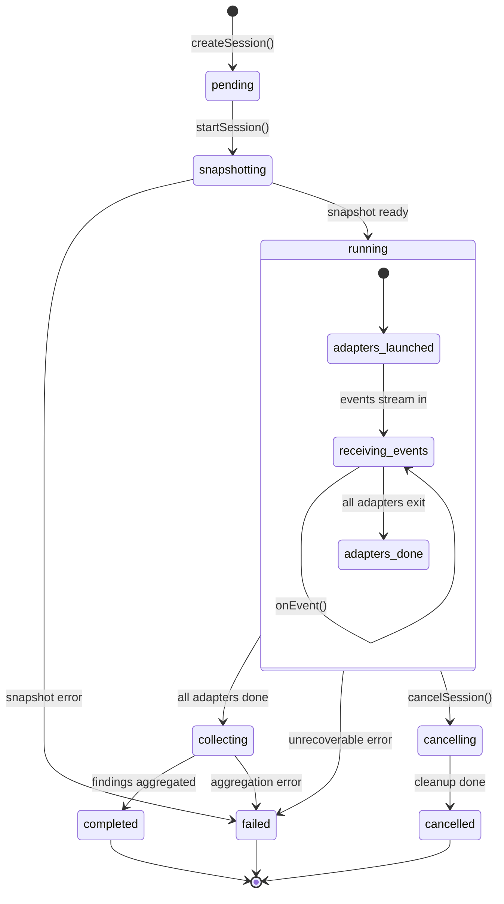
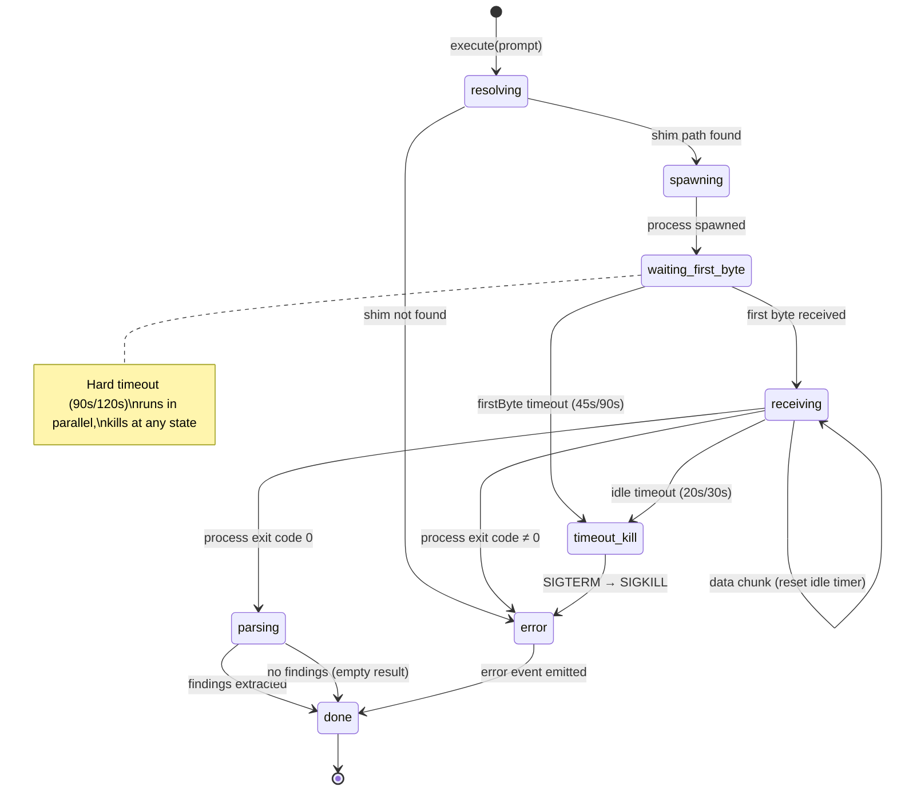
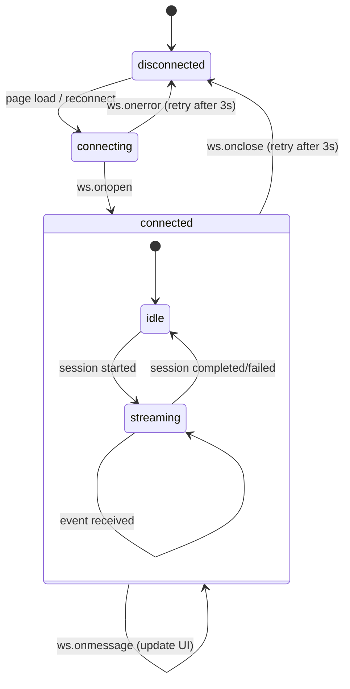
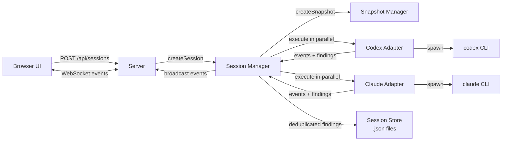

OpenAI Codex v0.111.0 (research preview)
--------
workdir: D:\extension
model: gpt-5.4
provider: openai
approval: never
sandbox: read-only
reasoning effort: xhigh
reasoning summaries: none
session id: 019ccc2c-6e2d-72d0-bb3d-3ba324495877
--------
user
# Critique Request: Phase 1 Implementation Plan

You are a senior code reviewer and architect. Your job is to critique the implementation plan below. Be harsh, specific, and constructive. No fluff.

## Context

This is a multi-agent communication hub that enables AI agents (Antigravity, Codex CLI, Claude Code CLI) to collaborate on code review through an event-driven architecture. Phase 0 Spike is complete with all gate tests passed (evidence in `docs/spike-results-v3.json`).

The implementation plan below describes Phase 1: the core Event-Driven Hub build.

## Your Task

1. Read the implementation plan carefully
2. Find issues, gaps, risks, or mistakes
3. For each finding, provide:
   - **Category**: one of [architecture, testing, security, performance, correctness, missing, naming, windows-compat]
   - **Severity**: one of [critical, high, medium, low]
   - **Finding**: what's wrong
   - **Evidence**: why you think it's wrong (reference specific sections)
   - **Recommendation**: actionable fix

## Key things to check:
- Does the architecture match the state machines?
- Are the timeout values proven by spike evidence?
- Is the testing strategy complete (unit tests mock correctly, integration tests actually test)?
- Windows compatibility (this runs on Windows, PowerShell)
- Are there race conditions in parallel adapter execution?
- Is the finding dedup strategy correct? Could it miss findings or false-merge?
- Is the snapshot strategy (git worktree) safe on Windows?
- Is the WS server handling backpressure?
- File path handling (Windows backslashes vs POSIX)
- Error propagation from adapters → hub → server → client
- Is the REST API design RESTful and consistent?

## IMPORTANT RULES
- Do NOT suggest TypeScript migration — that's explicitly Phase 2
- Do NOT suggest adding a database — JSON files are the Phase 1 decision
- Do NOT suggest Express/Fastify — vanilla HTTP is intentional
- Focus on what's WRONG or MISSING, not what's right
- Maximum 10 findings, minimum 3
- Output as structured markdown with numbered findings

---

## Implementation Plan

# Phase 1: Event-Driven Hub — Implementation Plan

Phase 0 Spike is ✅ complete — all patterns proven (`spike-results-v3.json`). This plan covers the Phase 1 Core Hub build: Agent Adapters, Hub/Session Manager, Review Snapshot, Finding Schema, and a simple browser UI.

## User Review Required

> [!IMPORTANT]
> **JavaScript or TypeScript?** AGENTS.md says "JavaScript (migrating to TypeScript in Phase 1)". This plan uses **JavaScript with JSDoc types** for iteration speed. TypeScript migration can happen in Phase 2.

> [!IMPORTANT]
> **Framework choice**: This plan uses vanilla Node.js HTTP + `ws` WebSocket. No Express needed at this scale. Should this change?

> [!WARNING]
> **Codex and Claude CLI must be globally installed** on the machine for tests to pass. The plan assumes both are available via `where codex` / `where claude`.

---

## State Machines

### Session Lifecycle

The core state machine — every review session follows this flow:



**Guards & side-effects:**

| Transition | Guard | Side-effect |
|---|---|---|
| `pending → snapshotting` | session exists | `snapshotManager.create()` |
| `snapshotting → running` | snapshot path valid | launch Codex + Claude adapters in parallel |
| `running.onEvent()` | valid event envelope | deduplicate finding, broadcast via WS |
| `running → collecting` | both adapters exited | stop heartbeat timer |
| `collecting → completed` | — | persist session JSON, cleanup snapshot |
| `* → failed` | error caught | persist error, cleanup snapshot |
| `running → cancelling` | session is running | kill adapter processes (SIGTERM → SIGKILL) |

---

### Adapter Execution

Each agent adapter (Codex/Claude) follows this internal state machine with 3-tier timeout:



**Timeout tiers (from spike v3):**

| Tier | Codex | Claude | Purpose |
|---|---|---|---|
| `firstByte` | 45s | 90s | Detect CLI not responding at all |
| `idle` | 20s | 30s | Detect hung process mid-output |
| `hard` | 90s | 120s | Absolute max wall-clock time |

---

### WebSocket Client (Browser UI)



---

### Data Flow Overview



---

## Proposed Changes

### Pre-requisites: Package Setup

#### [MODIFY] [package.json](file:///d:/extension/package.json)

Add proper project metadata, scripts, and dependencies:

```json
{
  "name": "extension-hub",
  "version": "0.1.0",
  "type": "module",
  "scripts": {
    "start": "node src/server.js",
    "test": "node --test src/**/*.test.js",
    "test:unit": "node --test src/**/*.test.js",
    "spike": "node scripts/spike-test-v3.js"
  },
  "dependencies": {
    "cross-spawn": "^7.0.6",
    "ws": "^8.18.0",
    "uuid": "^9.0.0"
  },
  "devDependencies": {}
}
```

Uses Node.js 20 built-in test runner (`node --test`) — no Jest/Vitest dependency needed.

---

### Component 1: Agent Adapter Layer

Extracts the proven `runAgent()` pattern from `spike-test-v3.js` into a reusable adapter that emits structured events.

#### [NEW] [src/adapters/base-adapter.js](file:///d:/extension/src/adapters/base-adapter.js)

Base class for all agent adapters. Core responsibilities:
- Wraps `cross-spawn` with 3-tier timeout (from spike v3)
- Emits structured events: `status`, `finding`, `error`, `heartbeat`
- Captures stdout/stderr separately, decodes explicit UTF-8
- Detects garbled output (replacement chars `\ufffd`) — logs warning, skips relay
- Provides `combinedBytes` for pass/fail (not just stdoutBytes)

Key methods:
- `execute(prompt, opts)` → returns `{ events[], rawResult }`
- `parseOutput(rawResult)` → extract findings from raw text (override per agent)
- `#spawnWithTimeout(file, args, timeouts)` → private, reuses spike v3's `runAgent()`

#### [NEW] [src/adapters/codex-adapter.js](file:///d:/extension/src/adapters/codex-adapter.js)

Codex-specific adapter:
- Resolves `codex` shim path (reuses `resolveShim()` from spike v3)
- Command: `codex review "<prompt>"` 
- Timeout preset: `firstByte=45s, idle=20s, hard=90s`
- Output parsing: Codex outputs to **stderr** — parse combinedOutput
- Finding extraction: regex-based extraction of severity/file/line patterns

#### [NEW] [src/adapters/claude-adapter.js](file:///d:/extension/src/adapters/claude-adapter.js)

Claude Code CLI adapter:
- Resolves `claude` shim path
- Command: `claude -p --no-session-persistence "<prompt>"`
- Supports `--output-format json` for structured output
- Timeout preset: `firstByte=90s, idle=30s, hard=120s`
- Finding extraction: parse structured JSON output when available, fallback to text parsing

#### [NEW] [src/adapters/base-adapter.test.js](file:///d:/extension/src/adapters/base-adapter.test.js)

Unit tests (no CLI required — mock spawn):
- Event emission format validation
- 3-tier timeout behavior (firstByte, idle, hard)
- UTF-8 garble detection
- combinedBytes calculation
- Error handling (spawn failure, signal)

---

### Component 2: Event Schema & Finding Model

#### [NEW] [src/schema/events.js](file:///d:/extension/src/schema/events.js)

Event factory functions matching BRIEF.md schema:

```javascript
// Creates validated event envelope
function createEvent(sessionId, agentId, eventType, payload) { ... }

// Creates finding with auto-generated dedupe_key
function createFinding({ severity, summary, evidence, file, line, confidence }) { ... }

// Dedupe key: hash(severity + file + line + summary)
function computeDedupeKey(finding) { ... }
```

#### [NEW] [src/schema/events.test.js](file:///d:/extension/src/schema/events.test.js)

Tests:
- Event envelope has all required fields
- Finding schema validation (severity enum, confidence range)
- Dedupe key is deterministic (same input → same key)
- Dedupe key differs when fields change

---

### Component 3: Review Snapshot Manager

#### [NEW] [src/snapshot/snapshot-manager.js](file:///d:/extension/src/snapshot/snapshot-manager.js)

Creates immutable review snapshots:
- `createSnapshot(workspacePath)` → `{ snapshotId, commitHash, snapshotPath }`
- Uses `git worktree add --detach` for read-only review copy
- Fallback: if worktree fails, use `robocopy /MIR` to temp directory
- `cleanupSnapshot(snapshotId)` → removes worktree/temp copy
- All findings tagged with `commit_hash` + `snapshot_id`

#### [NEW] [src/snapshot/snapshot-manager.test.js](file:///d:/extension/src/snapshot/snapshot-manager.test.js)

Tests (uses temp git repos, no real workspace):
- Snapshot creates a directory with correct commit hash
- Snapshot is read-only (or at least separate from source)
- Cleanup removes the snapshot directory
- Commit hash matches current HEAD

---

### Component 4: Hub / Session Manager

The orchestration core. Manages review sessions from start to finish.

#### [NEW] [src/hub/session.js](file:///d:/extension/src/hub/session.js)

Session lifecycle:
- `createSession(opts)` → `{ sessionId, status: 'pending' }`
- `startSession(sessionId)` → creates snapshot, launches adapters in parallel
- `onEvent(sessionId, event)` → routes events, deduplicates findings
- `endSession(sessionId)` → collects all findings, cleanup snapshot
- Status transitions: `pending → running → completed | failed | cancelled`

Finding aggregation:
- Collects findings from both agents
- Deduplicates by `dedupe_key`
- Merges when both agents flag same file/line (takes higher severity)

#### [NEW] [src/hub/session-store.js](file:///d:/extension/src/hub/session-store.js)

Simple file-based persistence:
- `save(session)` → writes JSON to `.extension/sessions/<id>.json`
- `load(sessionId)` → reads session from disk
- `list()` → returns all session summaries
- No database — JSON files are sufficient for Phase 1

#### [NEW] [src/hub/session.test.js](file:///d:/extension/src/hub/session.test.js)

Tests (mock adapters):
- Session lifecycle transitions
- Finding dedup (same dedupe_key → one finding)
- Finding merge (same file/line, different severity → higher wins)
- Session persistence (save + load roundtrip)
- Cancel mid-session cleans up snapshot

---

### Component 5: HTTP + WebSocket Server

#### [NEW] [src/server.js](file:///d:/extension/src/server.js)

Vanilla Node.js HTTP server + `ws` WebSocket:

**REST endpoints:**
- `POST /api/sessions` → create + start a review session
- `GET /api/sessions` → list all sessions
- `GET /api/sessions/:id` → get session details + findings
- `POST /api/sessions/:id/cancel` → cancel running session
- `GET /` → serve static UI

**WebSocket:**
- `ws://localhost:3456/ws` → real-time event stream
- Client subscribes to session events
- Server broadcasts: `status`, `finding`, `heartbeat`, `error`

#### [NEW] [src/server.test.js](file:///d:/extension/src/server.test.js)

Tests (mock hub):
- REST endpoint response shapes
- WebSocket connection + event broadcast
- Session creation via API
- Error handling (invalid session ID, etc.)

---

### Component 6: Browser UI

Simple single-page app served statically. No build step.

#### [NEW] [src/ui/index.html](file:///d:/extension/src/ui/index.html)

Dark-themed, modern UI with:
- **Header:** Project name, connection status indicator
- **Session panel:** Start new review, session list
- **Timeline:** Real-time event feed (status changes, findings arriving)
- **Findings table:** Sortable by severity, file, agent — with dedupe indicators
- WebSocket connection for live updates
- Responsive layout

#### [NEW] [src/ui/styles.css](file:///d:/extension/src/ui/styles.css)

Dark theme, modern aesthetics:
- CSS custom properties for theming
- Glassmorphism cards
- Color-coded severity badges (🔴 critical, 🟠 high, 🟡 medium, 🟢 low)
- Smooth transitions for event timeline

#### [NEW] [src/ui/app.js](file:///d:/extension/src/ui/app.js)

Client-side JavaScript:
- WebSocket connection with auto-reconnect
- Fetch API for REST calls
- DOM manipulation for event timeline + findings table
- Session management UI

---

## File Structure Summary

```
d:\extension\
├── src/
│   ├── adapters/
│   │   ├── base-adapter.js          # Core spawn + timeout + event emission
│   │   ├── base-adapter.test.js     # Unit tests (mock spawn)
│   │   ├── codex-adapter.js         # Codex CLI adapter
│   │   └── claude-adapter.js        # Claude Code CLI adapter
│   ├── schema/
│   │   ├── events.js                # Event/Finding factories + validation
│   │   └── events.test.js           # Schema unit tests
│   ├── snapshot/
│   │   ├── snapshot-manager.js      # Immutable review snapshots
│   │   └── snapshot-manager.test.js # Snapshot tests
│   ├── hub/
│   │   ├── session.js               # Session lifecycle + orchestration
│   │   ├── session-store.js         # File-based persistence
│   │   └── session.test.js          # Session unit tests
│   ├── ui/
│   │   ├── index.html               # Browser UI
│   │   ├── styles.css               # Dark theme styles
│   │   └── app.js                   # Client-side JS
│   └── server.js                    # HTTP + WS server
├── scripts/
│   └── spike-test-v3.js             # Phase 0 spike (kept as reference)
├── docs/                            # Existing docs
├── package.json                     # Updated
└── AGENTS.md                        # Updated
```

---

## Verification Plan

### Automated Tests

All tests use Node.js 20 built-in test runner (no external deps):

```powershell
# Run all unit tests
node --test src/**/*.test.js

# Run specific test file
node --test src/schema/events.test.js
node --test src/adapters/base-adapter.test.js
node --test src/hub/session.test.js
node --test src/snapshot/snapshot-manager.test.js
```

Unit tests use **mocked spawns** — they don't require Codex/Claude CLI to be installed.

### Integration Test (Manual — requires CLI)

After unit tests pass, run a real end-to-end test:

```powershell
# 1. Start the server
node src/server.js

# 2. In another terminal, trigger a review session
curl -X POST http://localhost:3456/api/sessions -H "Content-Type: application/json" -d "{\"prompt\": \"Review docs/BRIEF.md. List 3 findings.\"}"

# 3. Watch real-time events in browser
# Open http://localhost:3456 in browser
# Verify: timeline shows events, findings table populates

# 4. Check session results
curl http://localhost:3456/api/sessions
```

### Browser UI Verification

Using the `browser_subagent` tool:
1. Start server
2. Navigate to `http://localhost:3456`
3. Verify dark theme renders correctly
4. Verify WebSocket connection indicator
5. Start a review session via UI
6. Verify findings table displays results

### Acceptance Criteria (from BRIEF.md §9)

| Criteria | How to verify |
|----------|---------------|
| 2 reviewers parallel, same snapshot | Integration test: POST session, check both agents in findings |
| Reviewer read-only enforcement | Snapshot uses worktree/temp — verify source unchanged |
| UTF-8 full pipeline | Include Vietnamese prompt, verify no garble in findings |
| Session history save/load | Unit test: session-store roundtrip |
| Finding deduplication | Unit test: same dedupe_key → one finding |

---

## Implementation Order

1. **Schema** (events.js) — foundation, no dependencies
2. **Adapters** (base → codex → claude) — reuse spike patterns
3. **Snapshot Manager** — git worktree integration
4. **Session Manager** — orchestrates everything
5. **Server** — HTTP + WebSocket
6. **UI** — last, consumes everything else
7. **Integration test** — end-to-end validation


mcp: notebooklm-mcp starting
mcp: nmem-mcp starting
mcp: nmem-mcp ready
mcp: notebooklm-mcp ready
mcp startup: ready: nmem-mcp, notebooklm-mcp
codex
Using `architect-review` and `code-review-excellence` for this pass. I’m checking the plan against the repo evidence first: spike v3 outputs, BRIEF acceptance criteria, and the existing spike script, then I’ll turn that into concrete findings only.
exec
"C:\\WINDOWS\\System32\\WindowsPowerShell\\v1.0\\powershell.exe" -Command 'Get-ChildItem -Force' in D:\extensionexec
"C:\\WINDOWS\\System32\\WindowsPowerShell\\v1.0\\powershell.exe" -Command "Get-Content C:\\Users\\quang\\.gemini\\antigravity\\skills\\architect-review\\SKILL.md -TotalCount 220" in D:\extension succeeded in 220ms:
---
name: architect-review
description: Master software architect specializing in modern architecture
  patterns, clean architecture, microservices, event-driven systems, and DDD.
  Reviews system designs and code changes for architectural integrity,
  scalability, and maintainability. Use PROACTIVELY for architectural decisions.
metadata:
  model: opus
risk: unknown
source: community
---
You are a master software architect specializing in modern software architecture patterns, clean architecture principles, and distributed systems design.

## Use this skill when

- Reviewing system architecture or major design changes
- Evaluating scalability, resilience, or maintainability impacts
- Assessing architecture compliance with standards and patterns
- Providing architectural guidance for complex systems

 succeeded in 249ms:


    Directory: D:\extension


Mode                 LastWriteTime         Length Name  
----                 -------------         ------ ----  
d-----          3/8/2026   1:39 PM                .agent
                                                  s     
d-----          3/8/2026  11:27 AM                .brain
d-----          3/8/2026  12:54 PM                .feedb
                                                  ack   
d--h--          3/8/2026   1:04 PM                .git  
d-----          3/8/2026   1:01 PM                docs  
d-----          3/8/2026  12:59 PM                node_m
                                                  odules
d-----          3/8/2026  12:59 PM                script
                                                  s     
-a----          3/8/2026   1:02 PM           3403 AGENTS
                                                  .md   
exec
"C:\\WINDOWS\\System32\\WindowsPowerShell\\v1.0\\powershell.exe" -Command "Get-Content C:\\Users\\quang\\.gemini\\antigravity\\skills\\code-review-excellence\\SKILL.md -TotalCount 220" in D:\extension succeeded in 166ms:
---
name: code-review-excellence
description: "Master effective code review practices to provide constructive feedback, catch bugs early, and foster knowledge sharing while maintaining team morale. Use when reviewing pull requests, establishing..."
risk: unknown
source: community
---

# Code Review Excellence

Transform code reviews from gatekeeping to knowledge sharing through constructive feedback, systematic analysis, and collaborative improvement.

## Use this skill when

- Reviewing pull requests and code changes
- Establishing code review standards
- Mentoring developers through review feedback
- Auditing for correctness, security, or performance

## Do not use this skill when

codex
I’ve got the review criteria and I’m cross-checking the plan against actual Phase 0 evidence now. Next I’m pulling the spike script, spike result file, and BRIEF sections that define the accepted behavior so the critique stays grounded instead of hypothetical.
exec
"C:\\WINDOWS\\System32\\WindowsPowerShell\\v1.0\\powershell.exe" -Command 'rg --files docs scripts' in D:\extensionexec
"C:\\WINDOWS\\System32\\WindowsPowerShell\\v1.0\\powershell.exe" -Command "Get-Content docs\\BRIEF.md -TotalCount 260" in D:\extensionexec
"C:\\WINDOWS\\System32\\WindowsPowerShell\\v1.0\\powershell.exe" -Command "Get-Content docs\\spike-results-v3.json -TotalCount 260" in D:\extensionexec
"C:\\WINDOWS\\System32\\WindowsPowerShell\\v1.0\\powershell.exe" -Command "Get-Content scripts\\spike-test-v3.js -TotalCount 360" in D:\extension succeeded in 219ms:
scripts\spike-test.js
scripts\spike-test-v3.js
scripts\spike-test-v2.js
docs\spike-results.json
docs\spike-report.md
docs\spike-results-v3.json
docs\ideas.md
docs\BRIEF.md
docs\spike-results-v2.json
 succeeded in 236ms:
{
  "meta": {
    "version": "v3",
    "runAt": "2026-03-08T05:59:39.620Z",
    "codexShim": "C:\\Users\\quang\\AppData\\Roaming\\npm\\codex",
    "claudeShim": "C:\\Users\\quang\\AppData\\Roaming\\npm\\claude",
    "fixes": [
      "hasOutput uses combinedBytes (stdout+stderr), not stdoutBytes only",
      "spawn(shell:false) via cross-spawn fallback, not exec()",
      "3-tier timeout: firstByte/idle/hard per agent type",
      "Separate stdout/stderr/combined tracking",
      "Re-test Claude json + stream-json modes",
      "Resolved CLI shim paths (not shell resolution)",
      "UTF-8 round-trip on combinedOutput"
    ],
    "timeoutPresets": {
      "codex": {
        "firstByteMs": 45000,
        "idleMs": 20000,
        "hardMs": 90000
 succeeded in 238ms:
// Phase 0 Spike v3 — All Codex Recommendations Applied
// Fixes from Round 2 critique (8 findings, 8/8 accepted):
//   1. hasOutput uses combinedBytes (stdout+stderr), not stdoutBytes only
//   2. spawn(shell:false) via cross-spawn, not exec()
//   3. 3-tier timeout: firstByte/idle/hard (not single timeout)
//   4. Captures stdout, stderr, combinedOutput, combinedBytes separately
//   5. Codex stderr pollution filtered for pass/fail but preserved in results
//   6. UTF-8 round-trip verification
//   7. Parallel execution test
//   8. Claude json/stream-json modes re-tested

const { execSync } = require('child_process');
const path = require('path');
const fs = require('fs');

const WORKSPACE = 'd:\\extension';
const VIETNAMESE_SAMPLE = 'Đây là nội dung tiếng Việt để kiểm tra encoding UTF-8: ăâđêôơư ĂÂĐÊÔƠƯ';

// ── Timeout Presets (Codex recommendation: 3-tier) ────
const TIMEOUTS = {
 succeeded in 262ms:
# 💡 BRIEF v2: Extension — Agent Communication Hub

**Ngày tạo:** 2026-03-08
**Revision:** v2 (post-Codex critique, 9 findings accepted)
**Brainstorm cùng:** Quang

---

## 1. VẤN ĐỀ CẦN GIẢI QUYẾT

3 AI agents (Antigravity, Codex CLI, Claude Code CLI) giao tiếp bằng **ghi/đọc file .md** — chậm, mất context, bị lỗi encoding trong PowerShell.

| Vấn đề | Chi tiết |
|--------|---------|
| Lỗi encoding | Codex CLI output qua PowerShell bị garble tiếng Việt |
| Giao tiếp gián tiếp | Antigravity → ghi file → Codex đọc → ghi file → đọc lại |
| Không song song | Chỉ chạy 1 reviewer tại 1 thời điểm |
| Không trực quan | Không thấy agents hoạt động real-time |

---
codex
The repo evidence already exposed one important mismatch: the plan is treating some behaviors as settled that the spike only proved in narrower conditions. I’m pulling line-numbered references now so each finding ties back to either BRIEF or the spike instead of just “best practice” objections.
exec
"C:\\WINDOWS\\System32\\WindowsPowerShell\\v1.0\\powershell.exe" -Command "@'
const fs = require('fs');
const path = 'docs/BRIEF.md';
const lines = fs.readFileSync(path, 'utf8').split(/\\r?\\n/);
for (let i = 0; i < lines.length; i++) {
  const n = i + 1;
  if (n <= 220) console.log("'`${n}: ${lines[i]}`);
}
'"'@ | node -" in D:\extensionexec
"C:\\WINDOWS\\System32\\WindowsPowerShell\\v1.0\\powershell.exe" -Command "@'
const fs = require('fs');
const path = 'scripts/spike-test-v3.js';
const lines = fs.readFileSync(path, 'utf8').split(/\\r?\\n/);
const wanted = [/TIMEOUTS/, /runAgent\\(/, /resolveShim/, /--output-format json/, /stream-json/, /Parallel execution/, /Promise\\.all/, /shell: false/, /PYTHONIOENCODING/];
for (let i = 0; i < lines.length; i++) {
  const line = lines[i];
  if (wanted.some((re) => re.test(line))) {
    const start = Math.max(0, i - 3);
    const end = Math.min(lines.length, i + 8);
    console.log("'`--- lines ${start + 1}-${end} ---`);
    for (let j = start; j < end; j++) console.log(`${j + 1}: ${lines[j]}`);
  }
}
'"'@ | node -" in D:\extensionexec
"C:\\WINDOWS\\System32\\WindowsPowerShell\\v1.0\\powershell.exe" -Command "@'
const fs = require('fs');
const path = 'docs/spike-results-v3.json';
const lines = fs.readFileSync(path, 'utf8').split(/\\r?\\n/);
for (let i = 0; i < lines.length; i++) {
  const n = i + 1;
  if (/timeoutPresets|stderrBytes|stream-json|Parallel execution|combinedBytes|output-format json|pass/.test(lines[i])) {
    const start = Math.max(0, i - 2);
    const end = Math.min(lines.length, i + 6);
    console.log("'`--- lines ${start + 1}-${end} ---`);
    for (let j = start; j < end; j++) console.log(`${j + 1}: ${lines[j]}`);
  }
}
'"'@ | node -" in D:\extension exited -1 in 0ms:
`"C:\\WINDOWS\\System32\\WindowsPowerShell\\v1.0\\powershell.exe" -Command "@'
const fs = require('fs');
const path = 'docs/BRIEF.md';
const lines = fs.readFileSync(path, 'utf8').split(/\\r?\\n/);
for (let i = 0; i < lines.length; i++) {
  const n = i + 1;
  if (n <= 220) console.log("'`${n}: ${lines[i]}`);
}
'"'@ | node -"` rejected: blocked by policy
 exited -1 in 0ms:
`"C:\\WINDOWS\\System32\\WindowsPowerShell\\v1.0\\powershell.exe" -Command "@'
const fs = require('fs');
const path = 'scripts/spike-test-v3.js';
const lines = fs.readFileSync(path, 'utf8').split(/\\r?\\n/);
const wanted = [/TIMEOUTS/, /runAgent\\(/, /resolveShim/, /--output-format json/, /stream-json/, /Parallel execution/, /Promise\\.all/, /shell: false/, /PYTHONIOENCODING/];
for (let i = 0; i < lines.length; i++) {
  const line = lines[i];
  if (wanted.some((re) => re.test(line))) {
    const start = Math.max(0, i - 3);
    const end = Math.min(lines.length, i + 8);
    console.log("'`--- lines ${start + 1}-${end} ---`);
    for (let j = start; j < end; j++) console.log(`${j + 1}: ${lines[j]}`);
  }
}
'"'@ | node -"` rejected: blocked by policy
 exited -1 in 0ms:
`"C:\\WINDOWS\\System32\\WindowsPowerShell\\v1.0\\powershell.exe" -Command "@'
const fs = require('fs');
const path = 'docs/spike-results-v3.json';
const lines = fs.readFileSync(path, 'utf8').split(/\\r?\\n/);
for (let i = 0; i < lines.length; i++) {
  const n = i + 1;
  if (/timeoutPresets|stderrBytes|stream-json|Parallel execution|combinedBytes|output-format json|pass/.test(lines[i])) {
    const start = Math.max(0, i - 2);
    const end = Math.min(lines.length, i + 6);
    console.log("'`--- lines ${start + 1}-${end} ---`);
    for (let j = start; j < end; j++) console.log(`${j + 1}: ${lines[j]}`);
  }
}
'"'@ | node -"` rejected: blocked by policy
codex
The shell blocked my first attempt at extracting numbered excerpts because of the inline script shape. I’m switching to plain PowerShell line-numbering so I can still cite exact evidence cleanly.
exec
"C:\\WINDOWS\\System32\\WindowsPowerShell\\v1.0\\powershell.exe" -Command '$i=1; Get-Content -Encoding utf8 docs'"\\BRIEF.md | ForEach-Object { if("'$i -le 220){ '"'{0}: {1}' -f "'$i, $_ }; $i++ }' in D:\extensionexec
"C:\\WINDOWS\\System32\\WindowsPowerShell\\v1.0\\powershell.exe" -Command '$patterns = '"'TIMEOUTS','runAgent(','resolveShim','output-format json','stream-json','Parallel execution','Promise.all','shell: false','PYTHONIOENCODING'; "'$lines = Get-Content -Encoding utf8 scripts'"\\spike-test-v3.js; for("'$i=0; $i -lt $lines.Length; $i++){ foreach($p in $patterns){ if($lines[$i].Contains($p)){ $start=[Math]::Max(0,$i-3); $end=[Math]::Min($lines.Length-1,$i+7); '"'--- lines {0}-{1} ---' -f ("'$start+1),($end+1); for($j=$start; $j -le $end; $j++){ '"'{0}: {1}' -f ("'$j+1), $lines[$j] }; break } } }' in D:\extensionexec
"C:\\WINDOWS\\System32\\WindowsPowerShell\\v1.0\\powershell.exe" -Command '$patterns = '"'timeoutPresets','stderrBytes','stream-json','Parallel execution','combinedBytes','output-format json','\"pass\"'; "'$lines = Get-Content -Encoding utf8 docs'"\\spike-results-v3.json; for("'$i=0; $i -lt $lines.Length; $i++){ foreach($p in $patterns){ if($lines[$i].Contains($p)){ $start=[Math]::Max(0,$i-2); $end=[Math]::Min($lines.Length-1,$i+5); '"'--- lines {0}-{1} ---' -f ("'$start+1),($end+1); for($j=$start; $j -le $end; $j++){ '"'{0}: {1}' -f ("'$j+1), $lines[$j] }; break } } }' in D:\extension exited -1 in 0ms:
`"C:\\WINDOWS\\System32\\WindowsPowerShell\\v1.0\\powershell.exe" -Command '$i=1; Get-Content -Encoding utf8 docs'"\\BRIEF.md | ForEach-Object { if("'$i -le 220){ '"'{0}: {1}' -f "'$i, $_ }; $i++ }'` rejected: blocked by policy
 exited -1 in 0ms:
`"C:\\WINDOWS\\System32\\WindowsPowerShell\\v1.0\\powershell.exe" -Command '$patterns = '"'TIMEOUTS','runAgent(','resolveShim','output-format json','stream-json','Parallel execution','Promise.all','shell: false','PYTHONIOENCODING'; "'$lines = Get-Content -Encoding utf8 scripts'"\\spike-test-v3.js; for("'$i=0; $i -lt $lines.Length; $i++){ foreach($p in $patterns){ if($lines[$i].Contains($p)){ $start=[Math]::Max(0,$i-3); $end=[Math]::Min($lines.Length-1,$i+7); '"'--- lines {0}-{1} ---' -f ("'$start+1),($end+1); for($j=$start; $j -le $end; $j++){ '"'{0}: {1}' -f ("'$j+1), $lines[$j] }; break } } }'` rejected: blocked by policy
 exited -1 in 0ms:
`"C:\\WINDOWS\\System32\\WindowsPowerShell\\v1.0\\powershell.exe" -Command '$patterns = '"'timeoutPresets','stderrBytes','stream-json','Parallel execution','combinedBytes','output-format json','\"pass\"'; "'$lines = Get-Content -Encoding utf8 docs'"\\spike-results-v3.json; for("'$i=0; $i -lt $lines.Length; $i++){ foreach($p in $patterns){ if($lines[$i].Contains($p)){ $start=[Math]::Max(0,$i-2); $end=[Math]::Min($lines.Length-1,$i+5); '"'--- lines {0}-{1} ---' -f ("'$start+1),($end+1); for($j=$start; $j -le $end; $j++){ '"'{0}: {1}' -f ("'$j+1), $lines[$j] }; break } } }'` rejected: blocked by policy
exec
"C:\\WINDOWS\\System32\\WindowsPowerShell\\v1.0\\powershell.exe" -Command 'rg -n "WebSocket|SSE|immutable snapshot|read-only|Large output|Retry failed review|Cancel review|Duplicate findings|Session history|Phase 2|same snapshot|same revision" docs/BRIEF.md' in D:\extensionexec
"C:\\WINDOWS\\System32\\WindowsPowerShell\\v1.0\\powershell.exe" -Command "rg -n \"timeoutPresets|stderrBytes|stream-json|Parallel execution|combinedBytes|output-format json|\\\"pass\\\"|Codex CLI headless|Claude --output-format json\" docs/spike-results-v3.json" in D:\extensionexec
"C:\\WINDOWS\\System32\\WindowsPowerShell\\v1.0\\powershell.exe" -Command "rg -n \"TIMEOUTS|runAgent\\(|resolveShim|output-format json|stream-json|Parallel execution|Promise\\.all|shell: false|PYTHONIOENCODING|combinedBytes|stderrBytes\" scripts/spike-test-v3.js" in D:\extension exited 1 in 224ms:
rg: unrecognized flag --output-format
 succeeded in 229ms:
31:                       │ WebSocket / SSE
55:- UI nhận events qua WebSocket/SSE, render timeline + findings
56:- Review chạy trên **immutable snapshot** (git worktree hoặc read-only copy)
68:> ⚠️ Chỉ Antigravity được **sửa code**. Reviewers chạy trên read-only snapshot. Đây là **enforcement kỹ thuật** (worktree/permissions), không chỉ policy.
74:> **Thay đổi từ v1:** Thêm concept immutable snapshot để findings không lệch revision.
78:2. Mỗi reviewer nhận **git worktree read-only** hoặc temp copy
151:- [ ] Session history storage
154:### 🎨 Phase 2: Polish (3-5 ngày)
176:| Phase 2 Polish | 3-5 ngày | Phase 1 stable |
187:| Large output streaming | 🟡 Medium | Chunked transfer + backpressure |
198:- [ ] Reviewer không write vào source — read-only enforcement
200:- [ ] Large output (>100KB) stream không crash, không truncate
201:- [ ] Cancel review giữa chừng → cleanup sạch
202:- [ ] Retry failed review → resume hoặc restart clean
203:- [ ] Duplicate findings bị dedup, không hiện 2 lần
204:- [ ] Session history lưu và load lại được
 succeeded in 182ms:
3://   1. hasOutput uses combinedBytes (stdout+stderr), not stdoutBytes only
6://   4. Captures stdout, stderr, combinedOutput, combinedBytes separately
9://   7. Parallel execution test
10://   8. Claude json/stream-json modes re-tested
20:const TIMEOUTS = {
28:function resolveShim(name) {
49:// Direct translation of Codex's runAgent() reference implementation
50:function runAgent(file, args, { cwd, firstByteMs = 90000, idleMs = 30000, hardMs = 120000 } = {}) {
70:      shell: false,
73:      env: { ...process.env, PYTHONIOENCODING: 'utf-8' },
111:      const stderrBytes = Buffer.byteLength(stderr, 'utf-8');
119:        stderrBytes,
121:        combinedBytes: stdoutBytes + stderrBytes,
130:  const timeouts = TIMEOUTS[timeoutPreset] || TIMEOUTS.claude;
136:    const result = await runAgent(shimPath, args, { cwd: WORKSPACE, ...timeouts });
169:      stderrBytes: Buffer.byteLength(err.message, 'utf-8'),
171:      combinedBytes: Buffer.byteLength(err.message, 'utf-8'),
177:// ── Pass/Fail Logic (FIXED: uses combinedBytes) ───────
182:  // CRITICAL FIX: use combinedBytes, not stdoutBytes
183:  const hasOutput = (result.combinedBytes || 0) > 0;
codex
I’ve confirmed the BRIEF line anchors for the acceptance criteria. I’m rerunning the spike-result grep with proper escaping because the `--output-format` pattern got parsed as an `rg` flag on the first try.
exec
"C:\\WINDOWS\\System32\\WindowsPowerShell\\v1.0\\powershell.exe" -Command "rg -n -- \"timeoutPresets|stderrBytes|stream-json|Parallel execution|combinedBytes|output-format json|\\\"pass\\\"|Codex CLI headless|Claude --output-format json\" docs/spike-results-v3.json" in D:\extensionexec
"C:\\WINDOWS\\System32\\WindowsPowerShell\\v1.0\\powershell.exe" -Command "rg -n --context 2 -- \"\\\"test\\\": \\\"Codex CLI headless|\\\"test\\\": \\\"Claude --output-format json|\\\"test\\\": \\\"Claude --output-format stream-json|\\\"test\\\": \\\"Parallel execution|stderrBytes|combinedBytes|timeoutPresets\" docs/spike-results-v3.json" in D:\extension exited -1 in 0ms:
`"C:\\WINDOWS\\System32\\WindowsPowerShell\\v1.0\\powershell.exe" -Command "rg -n --context 2 -- \"\\\"test\\\": \\\"Codex CLI headless|\\\"test\\\": \\\"Claude --output-format json|\\\"test\\\": \\\"Claude --output-format stream-json|\\\"test\\\": \\\"Parallel execution|stderrBytes|combinedBytes|timeoutPresets\" docs/spike-results-v3.json"` rejected: blocked by policy
 exited 1 in 168ms:
rg: CLI: The system cannot find the file specified. (os error 2)
rg: headless|Claude: The filename, directory name, or volume label syntax is incorrect. (os error 123)
rg: --output-format: The system cannot find the file specified. (os error 2)
rg: json docs/spike-results-v3.json: The system cannot find the path specified. (os error 3)
exec
"C:\\WINDOWS\\System32\\WindowsPowerShell\\v1.0\\powershell.exe" -Command "findstr /n /c:\"Codex CLI headless (spawn, 3-tier timeout)\" /c:\"Claude --output-format json (re-test)\" /c:\"Claude --output-format stream-json (new test)\" /c:\"Parallel execution (spawn, 1+1 slots)\" docs\\spike-results-v3.json" in D:\extensionexec
"C:\\WINDOWS\\System32\\WindowsPowerShell\\v1.0\\powershell.exe" -Command "findstr /n /c:\"timeoutPresets\" /c:\"stderrBytes\" /c:\"combinedBytes\" /c:\"stream-json\" /c:\"Parallel execution\" /c:\"output-format json\" docs\\spike-results-v3.json" in D:\extension succeeded in 171ms:
36:      "test": "Codex CLI headless (spawn, 3-tier timeout)",
72:      "test": "Claude --output-format json (re-test)",
92:      "test": "Claude --output-format stream-json (new test)",
111:      "test": "Parallel execution (spawn, 1+1 slots)",
 succeeded in 163ms:
8:      "hasOutput uses combinedBytes (stdout+stderr), not stdoutBytes only",
12:      "Re-test Claude json + stream-json modes",
16:    "timeoutPresets": {
47:      "stderrBytes": 61838,
48:      "combinedBytes": 61838,
65:      "stderrBytes": 0,
66:      "combinedBytes": 110,
72:      "test": "Claude --output-format json (re-test)",
73:      "command": "claude -p --output-format json \"prompt\"",
85:      "stderrBytes": 0,
86:      "combinedBytes": 934,
92:      "test": "Claude --output-format stream-json (new test)",
93:      "command": "claude -p --output-format stream-json \"prompt\"",
104:      "stderrBytes": 74,
105:      "combinedBytes": 74,
108:      "stderrPreview": "Error: When using --print, --output-format=stream-json requires --verbose\n"
111:      "test": "Parallel execution (spawn, 1+1 slots)",
121:        "stderrBytes": 57337,
122:        "combinedBytes": 57337,
133:        "stderrBytes": 0,
codex
I’ve got enough to anchor most of the critique. I’m checking one last repo artifact for whether the spike or brief says anything stronger about throughput/backpressure and retry semantics, because those are where the plan currently looks the weakest.
exec
"C:\\WINDOWS\\System32\\WindowsPowerShell\\v1.0\\powershell.exe" -Command "Get-Content docs\\spike-report.md -TotalCount 260" in D:\extensionexec
"C:\\WINDOWS\\System32\\WindowsPowerShell\\v1.0\\powershell.exe" -Command "rg -n \"backpressure|Large output|retry|cancel|worktree|read-only|json|stream-json|timeout|firstByte|idle|hard|snapshot\" docs\\spike-report.md docs\\spike-results-v3.json docs\\BRIEF.md" in D:\extension succeeded in 181ms:
docs\spike-results-v3.json:10:      "3-tier timeout: firstByte/idle/hard per agent type",
docs\spike-results-v3.json:12:      "Re-test Claude json + stream-json modes",
docs\spike-results-v3.json:16:    "timeoutPresets": {
docs\spike-results-v3.json:18:        "firstByteMs": 45000,
docs\spike-results-v3.json:19:        "idleMs": 20000,
docs\spike-results-v3.json:20:        "hardMs": 90000
docs\spike-results-v3.json:23:        "firstByteMs": 90000,
docs\spike-results-v3.json:24:        "idleMs": 30000,
docs\spike-results-v3.json:25:        "hardMs": 120000
docs\spike-results-v3.json:28:        "firstByteMs": 30000,
docs\spike-results-v3.json:29:        "idleMs": 15000,
docs\spike-results-v3.json:30:        "hardMs": 45000
docs\spike-results-v3.json:36:      "test": "Codex CLI headless (spawn, 3-tier timeout)",
docs\spike-results-v3.json:49:      "timeoutReason": null,
docs\spike-results-v3.json:54:      "test": "Claude Code CLI headless (spawn, 3-tier timeout)",
docs\spike-results-v3.json:67:      "timeoutReason": null,
docs\spike-results-v3.json:72:      "test": "Claude --output-format json (re-test)",
docs\spike-results-v3.json:73:      "command": "claude -p --output-format json \"prompt\"",
docs\spike-results-v3.json:80:      "jsonParseable": true,
docs\spike-results-v3.json:87:      "timeoutReason": null,
 succeeded in 200ms:
# Spike Report — Phase 0: CLI Viability

**Date:** 2026-03-08  
**Version:** v2 (corrected test methodology per Codex critique)

## Executive Summary

**Overall: ⚠️ PARTIAL PASS — Both CLIs functional, integration quirks found**

Both Codex and Claude Code CLIs work headlessly on Windows. Automated tests flagged failures, but root cause analysis reveals **integration quirks** rather than blocking issues:

| Capability | Status | Note |
|---|---|---|
| Codex headless | ✅ Works | Output goes to **stderr**, not stdout |
| Claude text mode | ⚠️ Slow | Needs >60s timeout (MCP init overhead) |
| Claude json mode | ❌ Hangs | `--output-format json` confirmed unusable |
| Parallel execution | ✅ Works | Promise.all verified |
| UTF-8 round-trip | ✅ Works | Vietnamese/Japanese/emoji all pass |

## Test Results (v2)
exec
"C:\\WINDOWS\\System32\\WindowsPowerShell\\v1.0\\powershell.exe" -Command "rg -n \"Auto-merge findings|Dedup|merge|Duplicate findings|dedup\" docs\\BRIEF.md" in D:\extensionexec
"C:\\WINDOWS\\System32\\WindowsPowerShell\\v1.0\\powershell.exe" -Command "rg -n \"git worktree|robocopy|read-only|cleanup|save\\(|load\\(|list\\(|finding|dedupe|merge|POST /api/sessions|cancel|WebSocket|broadcast|heartbeat\" AGENTS.md package.json README.md" in D:\extension succeeded in 177ms:
AGENTS.md:32:│   ├── inbox.md          # Codex critique round 1 (6 findings)
AGENTS.md:33:│   ├── inbox-v2.md       # Codex critique round 2 (8 findings)
AGENTS.md:52:- **Immutable snapshots** — reviewers run on read-only copies (Phase 1)
 succeeded in 178ms:
36:│  • History storage      • Dedup & merge              │
110:  "dedupe_key": "hash(severity+file+line+summary)"
150:- [ ] Finding Schema + dedup
157:- [ ] Auto-merge findings trùng lặp
203:- [ ] Duplicate findings bị dedup, không hiện 2 lần
exec
"C:\\WINDOWS\\System32\\WindowsPowerShell\\v1.0\\powershell.exe" -Command "rg -n \"session_id|agent_id|event_type|dedupe_key|confidence|summary|file|line|id\" docs\\BRIEF.md" in D:\extensionexec
"C:\\WINDOWS\\System32\\WindowsPowerShell\\v1.0\\powershell.exe" -Command "rg -n \"status transitions|createSession|startSession|onEvent|endSession|Dedup|Merges when both agents flag same file/line|POST /api/sessions|cancel running session|broadcast|heartbeat|events\\[\\]|rawResult|execute\\(prompt, opts\\)\" scripts\\spike-test-v3.js docs\\BRIEF.md" in D:\extensionexec
"C:\\WINDOWS\\System32\\WindowsPowerShell\\v1.0\\powershell.exe" -Command "rg -n \"Cancel / retry / reconnect handling|Auto-merge findings|Finding Schema \\+ dedup|Review Snapshot \\(git worktree\\)|Session history storage\" docs\\BRIEF.md" in D:\extension succeeded in 189ms:
11:3 AI agents (Antigravity, Codex CLI, Claude Code CLI) giao tiếp bằng **ghi/đọc file .md** — chậm, mất context, bị lỗi encoding trong PowerShell.
16:| Giao tiếp gián tiếp | Antigravity → ghi file → Codex đọc → ghi file → đọc lại |
29:│         Timeline + Findings Table (Browser)         │
55:- UI nhận events qua WebSocket/SSE, render timeline + findings
79:3. Findings gắn với `commit_hash` + `snapshot_id`
91:  "session_id": "uuid",
92:  "agent_id": "codex | claude-code",
94:  "event_type": "finding | status | error | heartbeat",
103:  "id": "F-001",
105:  "summary": "Mô tả ngắn",
106:  "evidence": "Chi tiết, trích dẫn code",
107:  "file": "src/server.ts",
108:  "line": 42,
109:  "confidence": 0.9,
110:  "dedupe_key": "hash(severity+file+line+summary)"
124:5. Test case bắt buộc: Vietnamese sample text qua full pipeline
152:- [ ] Simple UI: timeline + findings table (browser)
156:- [ ] Side-by-side findings comparison
158:- [ ] Code annotation (link findings → line)
199:- [ ] Vietnamese text (UTF-8) qua full pipeline không garble
 succeeded in 195ms:
docs\BRIEF.md:36:│  • History storage      • Dedup & merge              │
docs\BRIEF.md:94:  "event_type": "finding | status | error | heartbeat",
 succeeded in 197ms:
149:- [ ] Review Snapshot (git worktree)
150:- [ ] Finding Schema + dedup
151:- [ ] Session history storage
157:- [ ] Auto-merge findings trùng lặp
160:- [ ] Cancel / retry / reconnect handling
exec
"C:\\WINDOWS\\System32\\WindowsPowerShell\\v1.0\\powershell.exe" -Command "rg -n \"\\\"seq\\\"|seq\" docs\\BRIEF.md" in D:\extensionexec
"C:\\WINDOWS\\System32\\WindowsPowerShell\\v1.0\\powershell.exe" -Command "rg -n \"Promise\\.all|all adapters|parallel\" docs\\BRIEF.md scripts\\spike-test-v3.js docs\\spike-results-v3.json" in D:\extension exited 1 in 174ms:
rg: regex parse error:
    (?:\)
    ^
error: unclosed group
 succeeded in 176ms:
scripts\spike-test-v3.js:375:  const [codex, claude] = await Promise.all([
scripts\spike-test-v3.js:376:    runCLI('parallel-codex', codexShim, ['review', prompt], 'codex'),
scripts\spike-test-v3.js:377:    runCLI('parallel-claude', claudeShim, ['-p', '--no-session-persistence', prompt], 'claude'),
scripts\spike-test-v3.js:390:    mechanism: 'Node.js spawn + Promise.all',
scripts\spike-test-v3.js:518:    if (r.ranParallel !== undefined) console.log(`   Ran parallel: ${r.ranParallel}`);
docs\spike-results-v3.json:112:      "mechanism": "Node.js spawn + Promise.all",
exec
"C:\\WINDOWS\\System32\\WindowsPowerShell\\v1.0\\powershell.exe" -Command "findstr /n /c:\"\\\"seq\\\"\" docs\\BRIEF.md" in D:\extension exited 1 in 160ms:

exec
"C:\\WINDOWS\\System32\\WindowsPowerShell\\v1.0\\powershell.exe" -Command "findstr /n seq docs\\BRIEF.md" in D:\extension succeeded in 146ms:
93:  "seq": 1,
codex
1. `Category:` correctness  
   `Severity:` critical  
   `Finding:` The snapshot plan does not actually enforce read-only review, and the test plan explicitly weakens the requirement.  
   `Evidence:` In Component 3, `git worktree add --detach` plus a `robocopy /MIR` fallback only gives you a separate tree, not an immutable one. The proposed test even says “read-only (or at least separate from source)”. That directly contradicts the BRIEF’s “technical enforcement” requirement in [docs/BRIEF.md](/D:/extension/docs/BRIEF.md#L68), [docs/BRIEF.md](/D:/extension/docs/BRIEF.md#L78), and [docs/BRIEF.md](/D:/extension/docs/BRIEF.md#L198).  
   `Recommendation:` Pick one concrete Windows-safe immutability mechanism and fail hard if it cannot be applied. At minimum: create the snapshot, then enforce read-only ACLs/attributes recursively, and test actual write attempts from a child process. Do not accept “separate from source” as sufficient.

2. `Category:` architecture  
   `Severity:` high  
   `Finding:` The adapter API is batch-oriented, but the state machines and UI require streaming.  
   `Evidence:` Component 1 defines `execute(prompt, opts) -> returns { events[], rawResult }`, which implies events are accumulated and returned after completion. But the Session Lifecycle state machine depends on `running.onEvent()` while the adapters are still running, and the WebSocket/UI design assumes real-time timeline updates. Those two designs do not match.  
   `Recommendation:` Make adapters expose an `AsyncIterable`/`EventEmitter` for live events plus a separate completion promise/result. The session manager should consume the stream incrementally and only finalize aggregation after the completion promise resolves.

3. `Category:` correctness  
   `Severity:` high  
   `Finding:` The dedupe/merge strategy is wrong in both directions: it will miss true duplicates and false-merge distinct findings.  
   `Evidence:` The proposed key is `hash(severity + file + line + summary)`, so the same bug with different wording or severity will not dedupe. Then Session Manager “merges when both agents flag same file/line (takes higher severity)”, which can collapse two different issues on one line into one record. BRIEF separates Phase 1 “Finding Schema + dedup” from Phase 2 “Auto-merge findings” in [docs/BRIEF.md](/D:/extension/docs/BRIEF.md#L150) and [docs/BRIEF.md](/D:/extension/docs/BRIEF.md#L157).  
   `Recommendation:` Remove severity from the dedupe fingerprint. Normalize location first, keep per-agent raw findings, and only merge when both normalized location and normalized issue fingerprint match. Treat “higher severity wins” as presentation logic, not identity logic.

4. `Category:` windows-compat  
   `Severity:` high  
   `Finding:` Path handling is underspecified and will break dedupe/merge on Windows.  
   `Evidence:` The schema hashes raw `file`, and the plan never normalizes paths before computing `dedupe_key`. On this project’s Windows target, one adapter can emit `src\\server.js` while another emits `src/server.js`, or vary casing. BRIEF’s finding schema uses raw file strings in [docs/BRIEF.md](/D:/extension/docs/BRIEF.md#L107) and [docs/BRIEF.md](/D:/extension/docs/BRIEF.md#L110).  
   `Recommendation:` Canonicalize every path to a repo-relative form before storage or hashing: resolve against snapshot root, reject escapes, normalize separators to `/`, and case-fold on Windows.

5. `Category:` correctness  
   `Severity:` high  
   `Finding:` Event ordering and per-session state mutation are racy.  
   `Evidence:` BRIEF requires an event `seq` field in [docs/BRIEF.md](/D:/extension/docs/BRIEF.md#L93), but the proposed `createEvent(sessionId, agentId, eventType, payload)` signature does not define who assigns it. At the same time, adapters run in parallel and `onEvent()` both deduplicates and broadcasts. Without a single session-side serializer, ordering and dedupe outcomes become nondeterministic.  
   `Recommendation:` The hub, not the adapters, must assign a session-global monotonic `seq`. Process all events for a session through a single queue/mutex, and use atomic temp-file-plus-rename writes if any state is persisted before completion.

6. `Category:` missing  
   `Severity:` high  
   `Finding:` Error propagation is undefined; one adapter failure can either kill the whole session or silently discard useful partial results.  
   `Evidence:` The adapter state machine sends any non-zero exit to `error`, while the session state machine has `running -> failed : unrecoverable error`, but the plan never defines which adapter errors are recoverable. There is no explicit policy for “Codex failed, Claude succeeded”.  
   `Recommendation:` Define adapter-local terminal states and a session aggregation policy. Snapshot/store/server failures should fail the session; adapter failures should produce partial completion with adapter status preserved and successful findings retained.

7. `Category:` performance  
   `Severity:` high  
   `Finding:` The WebSocket design has no backpressure strategy and no real subscription model.  
   `Evidence:` BRIEF explicitly calls out large-output backpressure risk in [docs/BRIEF.md](/D:/extension/docs/BRIEF.md#L187) and makes `>100KB` streaming part of MVP in [docs/BRIEF.md](/D:/extension/docs/BRIEF.md#L200). The plan just says `/ws` broadcasts `status`, `finding`, `heartbeat`, `error`; it does not define per-session filtering, queue bounds, `bufferedAmount` handling, or slow-client eviction.  
   `Recommendation:` Make subscriptions session-scoped, not global broadcast. Bound each client queue, coalesce heartbeats/status updates, and disconnect slow consumers once buffered output crosses a threshold.

8. `Category:` windows-compat  
   `Severity:` high  
   `Finding:` Cancellation is designed like POSIX, not Windows.  
   `Evidence:` The session lifecycle says cancellation is `kill adapter processes (SIGTERM -> SIGKILL)`. On Windows, that is not a real two-stage signal contract, and child process trees may survive. This project explicitly targets Windows/PowerShell.  
   `Recommendation:` Implement Windows-specific termination: `child.kill()` for best-effort graceful shutdown, then `taskkill /T /F /PID <pid>` after timeout to kill the full tree. Add an integration test that checks no orphan reviewer processes remain.

9. `Category:` correctness  
   `Severity:` medium  
   `Finding:` The timeout values are being treated as proven production numbers, but the spike only proved that one set of prompts did not fail under those presets.  
   `Evidence:` In [scripts/spike-test-v3.js](/D:/extension/scripts/spike-test-v3.js#L20) and [docs/spike-results-v3.json](/D:/extension/docs/spike-results-v3.json#L16), the values are configured presets, not measured first-byte or idle distributions. The results show successful runs, but they do not prove those thresholds are valid for larger reviews, slower machines, or the BRIEF’s `>100KB` output requirement in [docs/BRIEF.md](/D:/extension/docs/BRIEF.md#L200).  
   `Recommendation:` Treat them as defaults, not facts. Make them configurable per adapter, log actual first-byte/idle/hard timing telemetry, and validate them with slow-output and large-output fixtures before hard-coding them into production logic.

10. `Category:` testing  
   `Severity:` high  
   `Finding:` The verification plan does not cover the stated MVP, and it leaves a scope contradiction unresolved.  
   `Evidence:` BRIEF makes cancel, retry, dedup, history, and large-output streaming part of MVP in [docs/BRIEF.md](/D:/extension/docs/BRIEF.md#L200), [docs/BRIEF.md](/D:/extension/docs/BRIEF.md#L201), [docs/BRIEF.md](/D:/extension/docs/BRIEF.md#L202), [docs/BRIEF.md](/D:/extension/docs/BRIEF.md#L203), and [docs/BRIEF.md](/D:/extension/docs/BRIEF.md#L204). But the plan’s automated/manual verification only checks a subset, while Phase 2 still mentions “Cancel / retry / reconnect handling” in [docs/BRIEF.md](/D:/extension/docs/BRIEF.md#L160). That is an unresolved contract mismatch.  
   `Recommendation:` Resolve scope first: either remove those items from MVP or implement and test them in Phase 1. Add real integration tests for cancel, retry, reconnect, `>100KB` output, parser accuracy against captured CLI fixtures, and Windows-native API invocation (`curl.exe` or `Invoke-RestMethod`, not PowerShell’s `curl` alias).
tokens used
225,719
1. `Category:` correctness  
   `Severity:` critical  
   `Finding:` The snapshot plan does not actually enforce read-only review, and the test plan explicitly weakens the requirement.  
   `Evidence:` In Component 3, `git worktree add --detach` plus a `robocopy /MIR` fallback only gives you a separate tree, not an immutable one. The proposed test even says “read-only (or at least separate from source)”. That directly contradicts the BRIEF’s “technical enforcement” requirement in [docs/BRIEF.md](/D:/extension/docs/BRIEF.md#L68), [docs/BRIEF.md](/D:/extension/docs/BRIEF.md#L78), and [docs/BRIEF.md](/D:/extension/docs/BRIEF.md#L198).  
   `Recommendation:` Pick one concrete Windows-safe immutability mechanism and fail hard if it cannot be applied. At minimum: create the snapshot, then enforce read-only ACLs/attributes recursively, and test actual write attempts from a child process. Do not accept “separate from source” as sufficient.

2. `Category:` architecture  
   `Severity:` high  
   `Finding:` The adapter API is batch-oriented, but the state machines and UI require streaming.  
   `Evidence:` Component 1 defines `execute(prompt, opts) -> returns { events[], rawResult }`, which implies events are accumulated and returned after completion. But the Session Lifecycle state machine depends on `running.onEvent()` while the adapters are still running, and the WebSocket/UI design assumes real-time timeline updates. Those two designs do not match.  
   `Recommendation:` Make adapters expose an `AsyncIterable`/`EventEmitter` for live events plus a separate completion promise/result. The session manager should consume the stream incrementally and only finalize aggregation after the completion promise resolves.

3. `Category:` correctness  
   `Severity:` high  
   `Finding:` The dedupe/merge strategy is wrong in both directions: it will miss true duplicates and false-merge distinct findings.  
   `Evidence:` The proposed key is `hash(severity + file + line + summary)`, so the same bug with different wording or severity will not dedupe. Then Session Manager “merges when both agents flag same file/line (takes higher severity)”, which can collapse two different issues on one line into one record. BRIEF separates Phase 1 “Finding Schema + dedup” from Phase 2 “Auto-merge findings” in [docs/BRIEF.md](/D:/extension/docs/BRIEF.md#L150) and [docs/BRIEF.md](/D:/extension/docs/BRIEF.md#L157).  
   `Recommendation:` Remove severity from the dedupe fingerprint. Normalize location first, keep per-agent raw findings, and only merge when both normalized location and normalized issue fingerprint match. Treat “higher severity wins” as presentation logic, not identity logic.

4. `Category:` windows-compat  
   `Severity:` high  
   `Finding:` Path handling is underspecified and will break dedupe/merge on Windows.  
   `Evidence:` The schema hashes raw `file`, and the plan never normalizes paths before computing `dedupe_key`. On this project’s Windows target, one adapter can emit `src\\server.js` while another emits `src/server.js`, or vary casing. BRIEF’s finding schema uses raw file strings in [docs/BRIEF.md](/D:/extension/docs/BRIEF.md#L107) and [docs/BRIEF.md](/D:/extension/docs/BRIEF.md#L110).  
   `Recommendation:` Canonicalize every path to a repo-relative form before storage or hashing: resolve against snapshot root, reject escapes, normalize separators to `/`, and case-fold on Windows.

5. `Category:` correctness  
   `Severity:` high  
   `Finding:` Event ordering and per-session state mutation are racy.  
   `Evidence:` BRIEF requires an event `seq` field in [docs/BRIEF.md](/D:/extension/docs/BRIEF.md#L93), but the proposed `createEvent(sessionId, agentId, eventType, payload)` signature does not define who assigns it. At the same time, adapters run in parallel and `onEvent()` both deduplicates and broadcasts. Without a single session-side serializer, ordering and dedupe outcomes become nondeterministic.  
   `Recommendation:` The hub, not the adapters, must assign a session-global monotonic `seq`. Process all events for a session through a single queue/mutex, and use atomic temp-file-plus-rename writes if any state is persisted before completion.

6. `Category:` missing  
   `Severity:` high  
   `Finding:` Error propagation is undefined; one adapter failure can either kill the whole session or silently discard useful partial results.  
   `Evidence:` The adapter state machine sends any non-zero exit to `error`, while the session state machine has `running -> failed : unrecoverable error`, but the plan never defines which adapter errors are recoverable. There is no explicit policy for “Codex failed, Claude succeeded”.  
   `Recommendation:` Define adapter-local terminal states and a session aggregation policy. Snapshot/store/server failures should fail the session; adapter failures should produce partial completion with adapter status preserved and successful findings retained.

7. `Category:` performance  
   `Severity:` high  
   `Finding:` The WebSocket design has no backpressure strategy and no real subscription model.  
   `Evidence:` BRIEF explicitly calls out large-output backpressure risk in [docs/BRIEF.md](/D:/extension/docs/BRIEF.md#L187) and makes `>100KB` streaming part of MVP in [docs/BRIEF.md](/D:/extension/docs/BRIEF.md#L200). The plan just says `/ws` broadcasts `status`, `finding`, `heartbeat`, `error`; it does not define per-session filtering, queue bounds, `bufferedAmount` handling, or slow-client eviction.  
   `Recommendation:` Make subscriptions session-scoped, not global broadcast. Bound each client queue, coalesce heartbeats/status updates, and disconnect slow consumers once buffered output crosses a threshold.

8. `Category:` windows-compat  
   `Severity:` high  
   `Finding:` Cancellation is designed like POSIX, not Windows.  
   `Evidence:` The session lifecycle says cancellation is `kill adapter processes (SIGTERM -> SIGKILL)`. On Windows, that is not a real two-stage signal contract, and child process trees may survive. This project explicitly targets Windows/PowerShell.  
   `Recommendation:` Implement Windows-specific termination: `child.kill()` for best-effort graceful shutdown, then `taskkill /T /F /PID <pid>` after timeout to kill the full tree. Add an integration test that checks no orphan reviewer processes remain.

9. `Category:` correctness  
   `Severity:` medium  
   `Finding:` The timeout values are being treated as proven production numbers, but the spike only proved that one set of prompts did not fail under those presets.  
   `Evidence:` In [scripts/spike-test-v3.js](/D:/extension/scripts/spike-test-v3.js#L20) and [docs/spike-results-v3.json](/D:/extension/docs/spike-results-v3.json#L16), the values are configured presets, not measured first-byte or idle distributions. The results show successful runs, but they do not prove those thresholds are valid for larger reviews, slower machines, or the BRIEF’s `>100KB` output requirement in [docs/BRIEF.md](/D:/extension/docs/BRIEF.md#L200).  
   `Recommendation:` Treat them as defaults, not facts. Make them configurable per adapter, log actual first-byte/idle/hard timing telemetry, and validate them with slow-output and large-output fixtures before hard-coding them into production logic.

10. `Category:` testing  
   `Severity:` high  
   `Finding:` The verification plan does not cover the stated MVP, and it leaves a scope contradiction unresolved.  
   `Evidence:` BRIEF makes cancel, retry, dedup, history, and large-output streaming part of MVP in [docs/BRIEF.md](/D:/extension/docs/BRIEF.md#L200), [docs/BRIEF.md](/D:/extension/docs/BRIEF.md#L201), [docs/BRIEF.md](/D:/extension/docs/BRIEF.md#L202), [docs/BRIEF.md](/D:/extension/docs/BRIEF.md#L203), and [docs/BRIEF.md](/D:/extension/docs/BRIEF.md#L204). But the plan’s automated/manual verification only checks a subset, while Phase 2 still mentions “Cancel / retry / reconnect handling” in [docs/BRIEF.md](/D:/extension/docs/BRIEF.md#L160). That is an unresolved contract mismatch.  
   `Recommendation:` Resolve scope first: either remove those items from MVP or implement and test them in Phase 1. Add real integration tests for cancel, retry, reconnect, `>100KB` output, parser accuracy against captured CLI fixtures, and Windows-native API invocation (`curl.exe` or `Invoke-RestMethod`, not PowerShell’s `curl` alias).

