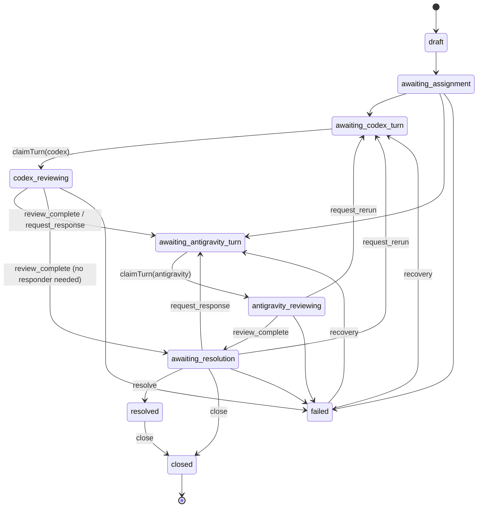
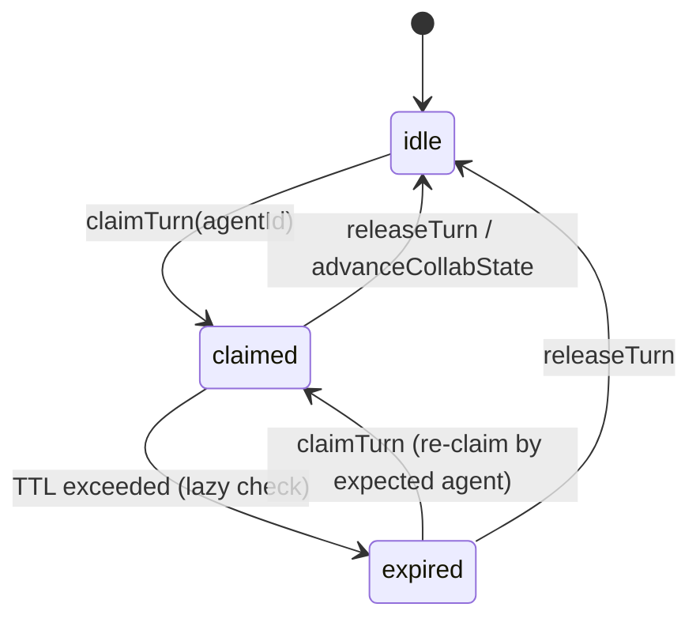
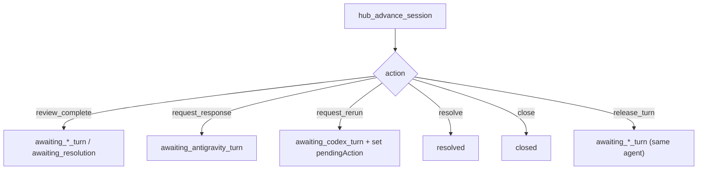

# Phase 2A — Agent-to-Agent MCP Collaboration Layer

## Phase 1: Review Summary

### Agree

Plan is well-structured and implementation-ready. Key strengths:
- Clean separation: domain logic in `session-collab.js` / `session-messages.js`, not in MCP handlers
- Explicit state machine with hardcoded transitions (not dynamic/configurable)
- Backward compatibility via optional collab fields with defaults
- Serialization is additive — old sessions load with default collab values
- Turn TTL + auto-expiry prevents deadlocks

### Risks

| # | Risk | Severity | Mitigation |
|---|------|----------|------------|
| 1 | **`events.js` EVENT_TYPES validation** — `createEvent()` rejects any event type not in the `EVENT_TYPES` array. Adding 9 new collab types will break if we forget to update `EVENT_TYPES`. | High | Update `EVENT_TYPES` to include all new types, OR make `createEvent()` accept collab types without strict validation. Recommend separate `COLLAB_EVENT_TYPES` merged into `EVENT_TYPES`. |
| 2 | **`session.addEvent()` blocks on terminal state** — `addEvent()` throws if `isTerminal()`. Collab actions like `close` → emitting `session_closed` event happen AFTER the session state changes. Can't emit event after terminal. | High | Emit events BEFORE state transition, or relax `addEvent()` for collab events on terminal sessions. |
| 3 | **`mcp-server.js` is already 466 lines** — Adding 5 new tools (~150+ lines) pushes it past 600. | Medium | Extract collab tool registration into `registerCollabTools(mcpServer, hub)` helper function in same file or `mcp-collab-tools.js`. |
| 4 | **MCP vs HTTP session state isolation** — MCP tools and HTTP server run different processes. Collab state changes via MCP won't be visible on HTTP dashboard. | Medium | Accepted limitation — same as current behavior. Document clearly. |
| 5 | **`session.state` vs `session.collabState` confusion** — Two parallel state machines on the same session object. | Low | Clear naming + JSDoc. `state` = review execution lifecycle. `collabState` = collaboration lifecycle. |
| 6 | **Turn expiry timing** — `expireTurnIfNeeded()` only runs when someone calls a collab method. No background timer. | Low | Acceptable for MVP. Document that consumers should poll or call before acting. |

### Changes Before Coding

1. **`events.js`**: Expand `EVENT_TYPES` to include all 9 collab event types BEFORE implementing tools. This prevents crashes.
2. **`session.addEvent()` terminal guard**: Allow collab lifecycle events (`session_closed`, `session_resolved`) to be emitted even in terminal state. Add a `force` parameter or whitelist.
3. **`mcp-server.js` file organization**: Register collab tools in a separate function `registerCollabTools()` to keep `buildMcpServer()` manageable. Can be in-file or `src/mcp-collab-tools.js`.
4. **`session.createRetry()` collab defaults**: Child sessions from rerun should inherit `assignments` but reset `collabState` to `awaiting_assignment` and clear `messages`/`turn`. Plan doesn't specify this clearly.

---

## State Machines

### Collaboration State Machine (`collabState`)



### Turn Lifecycle (`turn.status`)



### Advance Actions Flow



### Execution State vs Collaboration State

| `session.state` (execution) | `session.collabState` (collaboration) |
|------------------------------|---------------------------------------|
| `pending` | `draft` / `awaiting_assignment` |
| `running` | `awaiting_*_turn` / `*_reviewing` |
| `completed` | `awaiting_resolution` / `resolved` |
| `failed` | `failed` |
| `cancelled` | `closed` |

> [!NOTE]
> Two state machines co-exist on the same Session. `state` tracks review execution lifecycle. `collabState` tracks agent-to-agent collaboration lifecycle. They evolve independently.

---

## Phase 2: Implementation Plan

### Component 1: Domain Layer (Pure Logic)

---

#### [NEW] [session-collab.js](file:///d:/extension/src/hub/session-collab.js)

Collaboration state machine — pure functions, no I/O:
- `COLLAB_STATES` enum (11 states as specified)
- `COLLAB_TERMINAL_STATES` = `['resolved', 'closed']`
- `TURN_STATUS` enum (`idle`, `claimed`, `expired`)
- `ADVANCE_ACTIONS` enum (`review_complete`, `request_response`, `request_rerun`, `resolve`, `close`, `release_turn`)
- `defaultAssignments()` → `{ reviewer: 'codex', responder: 'antigravity', decider: 'antigravity' }`
- `createDefaultTurn()` → `{ status: 'idle', ownerId: null, token: null, ... }`
- `expectedAgentForState()` — maps state to expected agent
- `validateAdvanceAction()` — input validation
- `deriveNextCollabState()` — core transition function

---

#### [NEW] [session-messages.js](file:///d:/extension/src/hub/session-messages.js)

Message model + validation:
- `MESSAGE_TYPES` = `['note', 'review_summary', 'finding_reply', 'decision', 'rerun_request', 'resolution', 'system']`
- `MESSAGE_TYPES_REQUIRING_TURN` = `['review_summary', 'finding_reply', 'decision', 'rerun_request', 'resolution']`
- `buildSessionMessage()` — creates message with auto-seq, timestamp, validation
- `validateFindingRefs()` — checks refs exist in session findings
- `filterMessages()` — afterSeq, limit, types, agentId filtering

---

#### [MODIFY] [session.js](file:///d:/extension/src/hub/session.js)

Extend constructor with collab fields (with defaults for backward compat):
- `messages`, `messageSeqCounter`, `collabState`, `assignments`, `turn`, `pendingAction`
- New methods: `addMessage()`, `listMessages()`, `assignAgent()`, `claimTurn()`, `releaseTurn()`, `ensureTurnOwner()`, `advanceCollabState()`, `expireTurnIfNeeded()`, `isCollabTerminal()`, `getExpectedAgentForCurrentState()`
- Update `toJSON()`, `toSummaryJSON()` to include collab fields

---

#### [MODIFY] [session-serialization.js](file:///d:/extension/src/hub/session-serialization.js)

Add collab fields to `serializeSession()` and `hydrateSession()`:
- Messages, messageSeqCounter, collabState, assignments, turn, pendingAction
- Use `??` defaults so old sessions hydrate cleanly

---

### Component 2: Schema

---

#### [MODIFY] [events.js](file:///d:/extension/src/schema/events.js)

Add 9 collab event types to `EVENT_TYPES`:
- `message_posted`, `turn_claimed`, `turn_released`, `turn_expired`, `agent_assigned`, `collab_state_changed`, `resolution_requested`, `session_resolved`, `session_closed`

---

### Component 3: Transport Layer

---

#### [MODIFY] [mcp-server.js](file:///d:/extension/src/mcp-server.js)

Add 5 new MCP tools. Each follows pattern: ensureReady → load session → call domain method → save → emit event → return JSON:
- `hub_post_message`
- `hub_list_messages`
- `hub_claim_turn`
- `hub_assign_agent`
- `hub_advance_session`

Update `hub_get_status` to include collab fields.

---

#### [NEW] [collab-routes.js](file:///d:/extension/src/collab-routes.js)

REST parity for collab tools:
- `GET /api/sessions/:id/messages`
- `POST /api/sessions/:id/messages`
- `POST /api/sessions/:id/claim-turn`
- `POST /api/sessions/:id/assignments`
- `POST /api/sessions/:id/advance`

---

#### [MODIFY] [server.js](file:///d:/extension/src/server.js)

Add route dispatch for collab endpoints. Call `session.expireTurnIfNeeded()` before collab operations.

---

#### [MODIFY] [rebuttal-routes.js](file:///d:/extension/src/rebuttal-routes.js)

Ensure `createRetry()` child sessions get correct collab defaults. Mirror evaluate → message is TODO for now.

---

### Component 4: Tests

---

#### [NEW] [session-collab.test.js](file:///d:/extension/src/hub/session-collab.test.js)

- Default assignments
- Valid/invalid transitions
- `deriveNextCollabState` for all advance actions
- Expected agent mapping

#### [NEW] [session-messages.test.js](file:///d:/extension/src/hub/session-messages.test.js)

- Valid note message
- Reject empty content
- Reject invalid reply target
- Reject invalid finding refs
- afterSeq polling, limit, type filter, agentId filter

#### Updates to existing tests

- `session.test.js`: Constructor collab defaults, assignAgent, claimTurn, releaseTurn, advanceCollabState, serialization roundtrip
- `mcp-server.test.js`: Tool registration for 5 new tools

---

## Verification Plan

### Automated Tests

All tests use Node.js built-in test runner:

```powershell
# Domain layer tests (should pass first)
node --test src/hub/session-collab.test.js src/hub/session-messages.test.js

# Session integration tests
node --test src/hub/session.test.js

# Adapter tests (regression check)
node --test src/adapters/*.test.js

# MCP tool tests
node --test src/mcp-server.test.js

# Full suite (excluding server.test.js which may hang)
node --test src/hub/*.test.js src/schema/*.test.js src/adapters/*.test.js src/mcp-server.test.js
```

### Manual Verification

1. Start server: `npm start`
2. Create a session via HTTP, verify collab fields appear in response
3. Use MCP tools (via Antigravity) to: assign agents → claim turn → post message → advance state
4. Check dashboard at `localhost:3849` shows collab state
5. Verify old review flow still works: create → wait → get findings → evaluate
